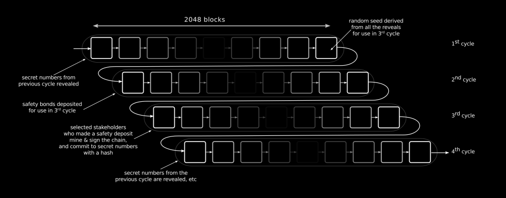

# Emmy family of consensus protocols

This document contains an overview of Emmy, Emmy+, and Emmy★.

## Emmy

Introduced in the [Tezos whitepaper](https://tezos.com/whitepaper.pdf), Emmy is the original proof-of-stake protocol used in the Tezos network. Inspired by [Slasher](https://blog.ethereum.org/2014/01/15/slasher-a-punitive-proof-of-stake-algorithm/), [chain-of-activity](www.cs.technion.ac.il/~idddo/CoA.pdf), and proof-of-burn.

Each block is mined (*baked*) by a random stakeholder (the *baker*) and includes multiple signatures (*endorsements*) of the previous block provided by random stakeholders (the *endorsers*). Baking and endorsing both offer small rewards but also require making a one cycle security deposit to be forfeited in the event of a double baking or double endorsing.

The protocl unfolds in cycles of 2048 blocks. At the beginning of each cycle `c`, a random seed is derived from numbers chosen by bakers and committed to in the penultimate cycle `c - 2`, and revealed in the last `c - 1`. This seed determines the baking priorities and endorsing rights for the next cycle `c + 1`.



### Block delays

The protocol imposes minimum delays between blocks. In principle, each block can be baked by any stakeholder. However, for a given block, each stakeholder is subject to a random minimum delay. The stakeholder receiving the highest priority may bake the block one minute after the previous block. The stakeholder receiving the second highest priority may bake the block two minutes after the previous block, the third, three minutes, and so on.

This guarantees that a fork where only a small fraction of stakeholders contribute will exhibit a low rate of block creation.

### Random seed generation

Every block baked carries a hash commitment to a random number chosen by the baker. These numbers must be revealed in the next cycle under penalty of forfeiting the safety bond.

All the revealed numbers in a cycle are combined in a hash list and the seed is derived from the root using the `scrypt` key derivation function.

### Follow-the-coin procedure

A **roll** is a collection of 10000 ꜩ. There are thus about one million rolls in existence. A database maps every roll to its current owner.

Each address holds a certain set of specific rolls as well as some loose change. When we desire to spend a fraction of a full roll, the roll is broken and its serial number is sent in a LIFO queue of rolls. Every transaction is processed in a way that minimizes the number of broken rolls. Whenever an address holds enough coins to form a roll, a serial number is pulled from the queue and the roll is formed again.

The LIFO priority ensures that an attacker working on a secret fork cannot change the coins he holds by shuffling change between accounts.

### Baking blocks

The random seed is used to repeatedly select a roll. The first roll selected allows its stakeholder to bake a block after one minute, the second one after two minutes — and so on.

To avoid a potentially problematic situation were no stakeholder made a safety deposit to bake a particular block, after a 16 minutes delay, the block may be baked without a deposit.

Bonds are implicitly returned to their buyers immediately in any chain where they do not bake a block.

### Endorsing blocks

A chain’s *weight* could be defined to be the number of blocks. However, this would open the door to a form of *selfish mining*.

Instead, a signing (*endorsing*) scheme is used and the number of endorsements constitutes the weight of a chain. While a block is being baked, the random seed is used to randomly assign 16 endorsing rights to 16 rolls.

The stakeholders who received endorsing rights observe the blocks being baked and then submit endorsements of that blocks. Those endorsements are then included in the next block, by bakers attempting to secure their parent’s inclusion in the blockchain.

The endorsement reward received by endorsers is inversely proportional to the time interval between the block and its predecessor.

Endorsers thus have a strong incentive to endorse what they genuinely believe to be the best block produced at that point. They also have a strong incentive to agree on which block they will endorse as endorsement rewards are only paid if the block is ultimately included in the blockchain.

### Denunciations

In order to avoid double baking and double endorsing, a baker may include a *denunciation* in their block.

This denunciation takes the form of two signatures. The baker and block endorsers sign the height of the block, making the proof of malfeasance quite concise.

Once a party has been found guilty of double baking or double endorsing, the safety bond is forfeited.

## Emmy+

[Protocol Babylon](https://tezos.gitlab.io/protocols/005_babylon.html)

### Main Ideas

- the fewer endorsements a block carries the longer it takes before it can be considered valid
- the fitness of a block is simply its height in the chain
- changes to the rewards for block and endorsement of priority greater than 0
  - discourages selfish baking

### Summary

We summarize next the main findings, which are obtained for the following security criterion: the rate at which a malicious fork can occur should be lower than 10^-8, that is, roughly once every two centuries.

Assuming an attacker that has at most 33% of the total stake, in our model we obtain that an operation included 6 blocks ago will only end up on the attacker’s chain (which might exclude that operation) once every two centuries, given that the chain is perfectly healthy during these last 6 levels (that is, no skipped priorities, no missed endorsements). Moreover, our analysis suggests that, for a freshly injected operation, and making no assumption on the health of the chain, 7, 16, and 67 block confirmations are recommended, assuming an attacker with a stake of 20%, 30%, and respectively 40% of the total stake. Here again, the statement is not absolute, but instead relative to our security criterion.

- selfish baking results in insignificant profits, even when the baker attempting it has a very large portion of the stake

### Changes introduced in Emmy+

- minimum block delay

```
emmy_plus_delay(p, e) =
  time_between_blocks[0] + p * time_between_blocks[1] +
  delay_per_missing_endorsement * max(0, (initial_endorsers - e))
```

```
dp := time_between_blocks[1]        \* delay per priority (per missed baking slot)
de := delay_per_missing_endorsement \* delay per (missed) endorsement (slot)
ie := initial_endorsers
```

- a baker with slot priority `n + 1` would be better off having their endorsement included in the block with priority `n` than by trying to steal the block at priority `n` by withholding their endorsement


## Emmy★

[Protocol: Granada](https://tezos.gitlab.io/protocols/010_granada.html)

- quicker finality than Emmy+: 2 confirmations (healthy chain less than 33% Byzantine stake)
- halve block times: 60s -> 30s
- 8x number of endorsement slots per block: 32 -> 256
- double number of blocks per cycle: 4096 -> 8192
  - other parameters are also doubled for backwards compatibility (see [Backwards compatibility](#backwards-compatibility))

Other changes in Granada:

- halve `hard_gas_limit_per_block`: 10,400,000 -> 5,200,000 gas units (to reduce block propagation times)

### Changes to Emmy+

- tweak the definition of the minimal delay function
- increase number of endorsements slots per block
  - significantly less confirmations needed to finalize a block

#### Minimal block delay formula

Emmy+ defines the **minimal block delay** of a block with respect to the previous block as a function of the current block's priority `p`, and the endorsing power `e` of the endorsements included in the current block:

```
emmy+_delay(p, e) = bd + pd * p + ed * max(0, ie - e)
```

- `bd` stands for base delay,
- `pd` stands for priority delay (that is, delay per missed baking slot),
- `ed` stands for delay per (missed) endorsement (slot),
- `ie` stands for initially required number of endorsements.

Since Babylon (Emmy+), the values of these parameters are set to: `bd = 60`, `pd = 40`, `ed = 8`, `ie = 24`.

Emmy★ builds on top of the above definition while taking advantage of the observation that

> most blocks are baked at priority 0 and with almost all endorsements

```
emmy*_delay(p, e) =
  md                   if p = 0 and e >= 3*te/5
  emmy+_delay(p, e)    otherwise

```

where `md` is a new parameter, called `minimal_block_delay`, whose value is proposed to be 30 seconds; while `te` refers to the existing parameter `endorsers_per_block` whose value is changed from 32 to 256. Also, the value of `ed` changes from 8 to 4.

#### Rewards

To keep roughly the same inflation rate as in Emmy+, in Emmy★, the reward values need to be updated. The reward formulas remain unchanged. We recall their definition from Carthage, in a slight reformulation:

```
baking_reward(p, e) =
  (level_rewards_prio_zero / 2) * e / te    if p = 0
  level_rewards_prio_nonzero * e / te       otherwise
```

Above, `level_rewards_prio_zero`, resp. `level_rewards_prio_nonzero` stands for rewards per level at priority 0, resp. rewards per level at a non-zero priority. Their values in Emmy+ are: `level_rewards_prio_zero = 80` and `level_rewards_prio_nonzero = 6`.

```
endorsing_reward(p, e) =
  baking_reward(0, e)          if p = 0
  baking_reward(0, e) * 2/3    otherwise

```

Since with Emmy★ there will normally be two times as many blocks per year, to preserve the inflation rate from Emmy+, in Emmy★ `level_rewards_prio_zero = 40` and `level_rewards_prio_nonzero = 3`.

Therefore, the rewards per endorsement slot are 16 times smaller in Emmy★ versus Emmy+:

- 2 times smaller because blocks would be produced two times faster, and
- 8 times smaller because there are 8 times more endorsement slots per level.

#### Security deposits

The values of the security deposits are updated with respect to the new value of `level_rewards_prio_zero`:

- `32 * level_rewards_prio_zero / 2 = 32 * 40 / 2 = 640` tez for baking,
- `32 * level_rewards_prio_zero / 2 / te = 32 * 40 / (2 * 256) = 2.5` tez for endorsing.

This way, security deposits are proportional with the maximum reward. The parameter value 32 is the one used in Emmy.

#### Rationale

Each of the two mentioned updates helps decrease the time to finality:

- Increasing the number of required endorsements makes nodes converge faster on the same chain. In other words, the number of confirmations decreases.
- While the new block delay formula does not help with decreasing the number of confirmations, it helps decrease the confirmation times simply by decreasing the time between blocks.

#### Backwards compatibility

To keep the duration of cycles and voting period the same, their length in number of blocks is doubled. The number of seed nonce commitments per cycle and of roll snapshots per cycle are kept the same. Concretely, the following parameters and their values in Emmy+

```
blocks_per_cycle = 4096
blocks_per_voting_period = 20480
blocks_per_commitment = 32
blocks_per_roll_snapshot = 256
```

are all *doubled* in Emmy★.

Also, to be able to reduce block propagation times, which depend on the block validation times, the value of the parameter `hard_gas_limit_per_block` is halved (from 10,400,000 to 5,200,000 gas units).

Finally, we note that the Michelson `NOW` instruction keeps the same intuitive meaning, namely it pushes on the stack the minimal injection time for the current block. However, this minimal injection time is not 1 minute after the previous block's timestamp as in Emmy+, but just 30 seconds after.

### Security considerations

Experiments show that, by stealing one or two blocks, the expected gains are tiny. For instance, for an attacker with 33% of stake, the expected gain for stealing one block is 0.000314898 tez. Assuming that blocks are baked twice as fast as in Emmy+, this would amount to a profit of 331 tez per year. Given that the probability of stealing more than 2 blocks is very low, the expected gains are even smaller in such cases.
